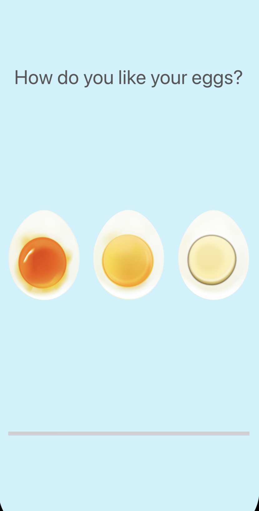
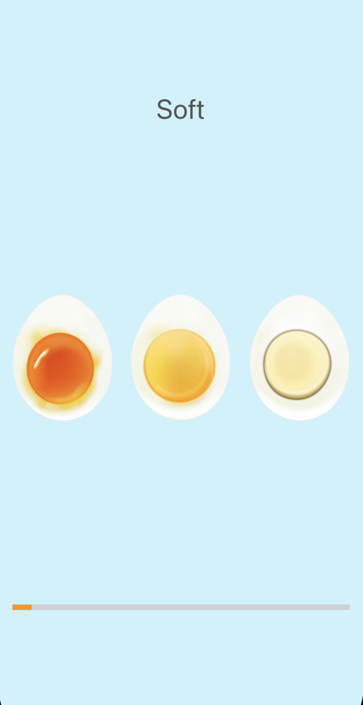
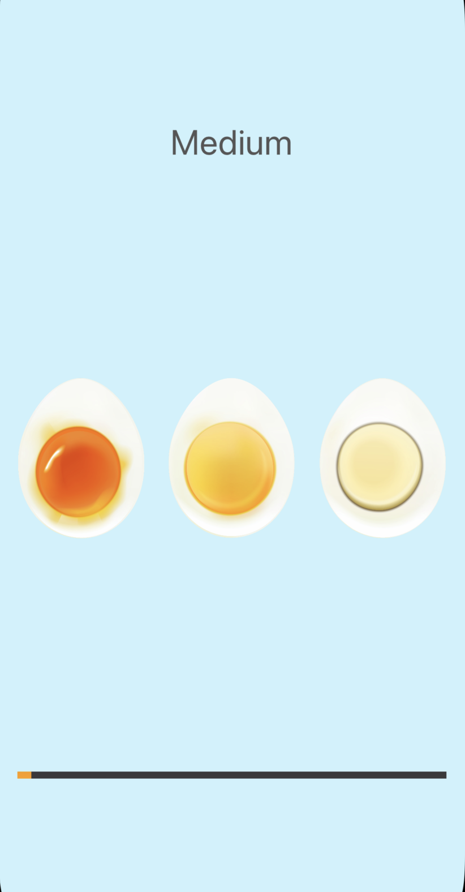
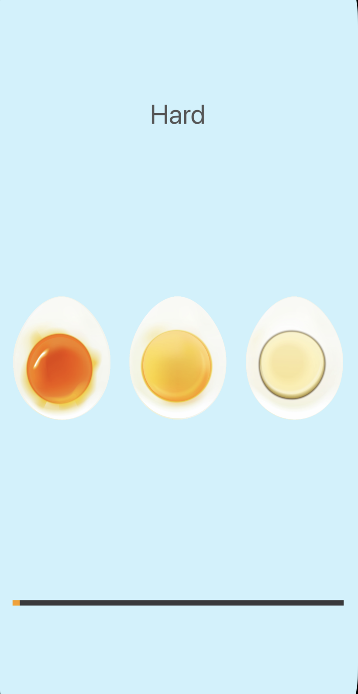

# 🥚 EggTimer App

The EggTimer App for boil eggs !  
Choose between **Soft, Medium, or Hard** modes, and the app will set the timer accordingly.

---

## 📱 Screenshot

  
  
  
  

---

## 🚀 Features
- ⏱️ Three egg modes: Soft, Medium, Hard
- 🔔 Plays an alert when the timer ends
- 🎨 Simple and easy-to-use interface

---

## ⚡ Technologies Used
- Swift (UIKit)
- Timer functionality
- UI Buttons
